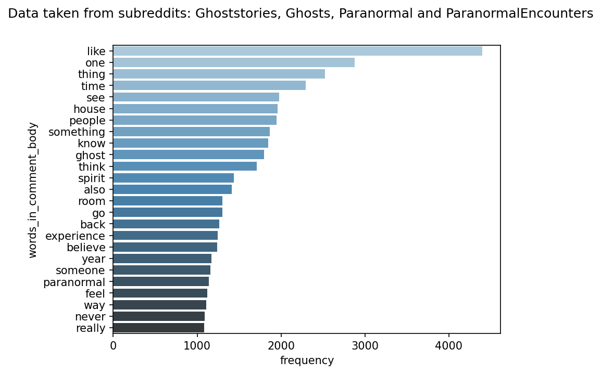

# Paranormal subreddits ELT

## Objective

This project wants to know at which hour the posts more voted are posted, the ratio between upvoting score vs number of comments and the most common words in posts and comments from the subreddits: Ghoststories, Ghosts, Paranormal, ParanormalEncounters.
The data was obtained from the [PRAW - The Python Reddit API Wrapper](https://praw.readthedocs.io/en/stable/index.html), which makes it easier to interact with the posts, comments, and subreddits from Reddit's social app.

## Architecture

    

## Data pipeline
A lot of the orchestration of the project is done via Github Actions located in [link to folder](.github/workflows/) and Prefect [link to folder](src/flows/).

[Github Actions](https://github.com/features/actions) is mainly used for running jobs (python scripts and dbt commands) via cronjob and [Prefect](https://www.prefect.io/) is responsible for creating the flows and connecting to Google Cloud services in a secure way using their [Blocks](https://docs.prefect.io/concepts/blocks/) and [Secrets](https://discourse.prefect.io/t/how-to-securely-store-secrets-in-prefect-2-0/1209). 

I query the top posts every day from the mentioned subreddits 4 times per day (3 am, 9 am, 15 pm and 21 pm) in order to obtain the posts that were popular during all the day and save them in Google Cloud Storage and Big Query. 
At 3:50 am I also query the comments from each post for obtaining the most frequent words in comments and info about the comments. Every time that I query the PRAW, I make sure to not include posts or comments that I have already in Google Cloud Storage, so, I only include new comments and posts.
With all the posts and comments saved in Google Cloud Storage, I also create wordclouds and graphs from the most frequent words in the post title, post text, and comment body:

    
    

Finally, at 4:10 am I run [dbt](https://docs.getdbt.com/) for cleaning and preparing de data from Big Query and serve it in [Google Looker Studio](https://lookerstudio.google.com)

