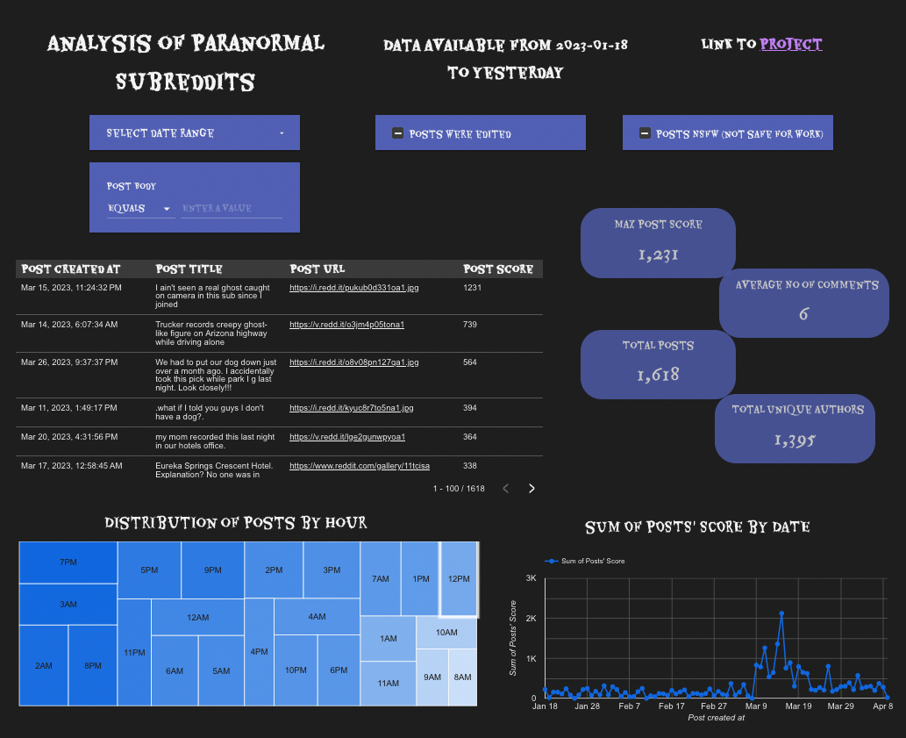

# Paranormal subreddits ELT

## Objective
This project involves extracting, loading, and transforming top posts and comments from four subreddits: Ghoststories, Ghosts, Paranormal, and ParanormalEncounters. By analyzing the data, I aim to determine the hourly distribution of posts, the correlation between post scores and comment numbers, the average number of comments per post, the maximum post score, the number of unique authors, and the most frequently used words in posts' text. To access the data, I use [PRAW](https://praw.readthedocs.io/en/stable/index.html), which is the Python Reddit API Wrapper that simplifies the process of interacting with Reddit's posts, comments, and subreddits.

## Architecture
<p align="center">
    
</p>

## Technologies used
 - [Terraform](https://developer.hashicorp.com/terraform/docs)
 - [PRAW](https://praw.readthedocs.io/en/stable/index.html)
 - [Github Actions](https://github.com/features/actions)
 - [Poetry (for the python environment)](https://python-poetry.org/docs/)
 - [Prefect](https://www.prefect.io/)
 - [Google Cloud Storage](https://cloud.google.com/storage/)
 - [Google Big Query](https://cloud.google.com/bigquery)
 - [dbt](https://docs.getdbt.com/)
 - [Google Looker Studio](https://lookerstudio.google.com)

## Data pipeline
A lot of the orchestration of the project is done via Github Actions located in [.github/workflows/](.github/workflows/) and Prefect flows which are in [src/flows/](src/flows/).

Github Actions is mainly used for running jobs (python scripts and dbt commands) via a cronjob and Prefect is responsible for creating the flows and connecting to Google Cloud services in a secure way using [Blocks](https://docs.prefect.io/concepts/blocks/) and [Secrets](https://discourse.prefect.io/t/how-to-securely-store-secrets-in-prefect-2-0/1209).

To ensure data consistency, each query made to PRAW stores the results in both Google Cloud Storage and Big Query. I also take care to exclude any posts or comments already stored in these locations to avoid duplication.

At four intervals throughout the day (3 am, 9 am, 3 pm, and 9 pm), I execute a query on the top posts from the selected subreddits.

At 3:50 am, I query the comments of each post to extract information about the most commonly used words and other details.

Finally, at 4:10 am, I use dbt to clean and prepare the data stored in Big Query for analysis, and then serve it in Google Looker Studio.

With all the posts and comments saved in Google Cloud Storage, I generate wordclouds and graphs that display the most commonly used words found in the post titles, post text, and comment bodies, which are saved [here](data/img/):
<p align="center">
    
</p>

## Prerequisites for running the project
- In case that you don't have one, create a project in Google Cloud, you can follow the [docs](https://developers.google.com/workspace/guides/create-project)

- Download [Terraform](https://developer.hashicorp.com/terraform/downloads) and move into the terraform folder `cd terraform/` and run `terraform init` for initializing a working directory containing Terraform configuration files

    - Create one environment variable in your terminal with the name **TF_VAR_project** that contains your project id from Google Cloud:
        ```bash
        $ export TF_VAR_project=your_project_id_from_google_cloud
        ```
    - Then build the infraestructure with the following commands:
        ```bash
        $ terraform plan -out init_infra.tfplan
        $ terraform apply init_infra.tfplan
        ```

- Python >=3.9 and <3.11

- To set up the required dependencies for running the Python scripts in this repository, follow the instructions in the [documentation](https://python-poetry.org/docs/) to install Poetry. Then, navigate to the root directory of the repository and run the command `poetry install`. This command creates a new environment based on the dependencies specified in [pyproject.toml](pyproject.toml), ensuring that you have the same library versions as I use and making it easy to run the scripts

- You will also have to create an agent that will interact with PRAW, here are the steps for doing it: https://praw.readthedocs.io/en/stable/getting_started/quick_start.html#prerequisites

- Use Prefect Cloud for configuring Secrets and Blocks that are used in the [flows scripts](src/flows/). Here is a [guide](https://docs.prefect.io/ui/cloud-quickstart/) for configuring Prefect Cloud. And here are explained the concepts of [Blocks](https://docs.prefect.io/concepts/blocks/) and [Secrets](https://discourse.prefect.io/t/how-to-securely-store-secrets-in-prefect-2-0/1209)

- Create a project in dbt with the name **dbt_reddit**:
    ```bash
    $ poetry run dbt init dbt_reddit
    ```

- *Optional* If you want to run it in Github Actions, you will have to create the following _secrets_ for your repo:
    - DBT_ENV_SECRET_GOOGLE_DATASET (the google dataset where is your table)
    - DBT_ENV_SECRET_PROJECT_ID (your google project id)
    - EMAIL (your email linked to Github)
    - KEYFILE_CONTENTS (the contents of the json file from your google service account)
    - PREFECT_API_KEY (your api key for connecting to Prefect Cloud)
    - PREFECT_WORKSPACE (the name of your workspace in Prefect Cloud)

## Run the scripts
It is **mandatory** to have done the steps in [Prerequisites section](#prerequisites-for-running-the-project)

- To run the prefect scripts and scrape the top posts and comments of the subreddits simply type in the root dir of the repo:
    ```bash
    $ poetry run python src/flows/reddit_posts_scraper.py
    $ poetry run python src/flows/reddit_comments_scraper.py
    ```

- To update the Big Query tables with the contents of Google Cloud Storage, you will have to run:
    ```bash
    # for updating the Big Query table of posts
    $ poetry run python src/flows/update_posts_in_bq.py
    # for updating the Big Query table of comments
    $ poetry run python src/flows/update_comments_in_bq.py
    ```

- To generate plots of the most commonly used words in the titles, text, and comments of the posts, run:
    ```bash
    $ poetry run python src/flows/create_plots.py
    ```

- To run dbt models:
    ```bash
    $ cd dbt_reddit/
    $ poetry run dbt run
    ``` 

## The dashboard
<p align="center">
    
</p>

[Link](https://lookerstudio.google.com/reporting/cee3df4d-cd34-4cb6-98c3-5031a62b0636) to the dashboard
